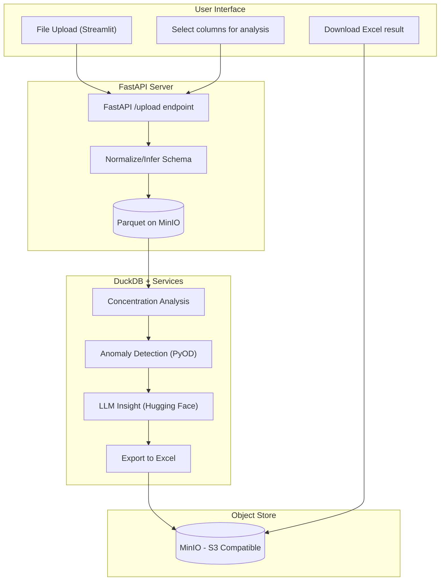

# Open Data Pipeline

A Lean data pipeline for analyzing Key Excel files, detecting anomalies and generating AI insights.

## Features

- **File Upload**: Upload Excel files through a user-friendly Streamlit interface
- **Data Normalization**: Automatic schema inference and data normalization
- **Concentration Analysis**: Identify data concentration patterns and imbalances
- **Anomaly Detection**: Detect anomalies using multiple methods (KNN, Isolation Forest)
- **AI Insights**: Generate actionable insights using local LLM (facebook/opt-350m)
- **Excel Export**: Download analysis results in Excel format
- **Object Storage**: S3-compatible storage using MinIO

## Architecture



## Components

### User Interface (Streamlit)
- File upload interface
- Column selection for analysis
- Interactive visualizations
- Download results

### API Server (FastAPI)
- File upload endpoint
- Data normalization
- Schema inference
- Parquet storage

### Processing Services
- **Concentration Analysis**: Identifies data concentration patterns
- **Anomaly Detection**: Uses PyOD for detecting anomalies
- **LLM Insights**: Generates insights using local Hugging Face model
- **Excel Export**: Creates formatted Excel reports

### Storage (MinIO)
- S3-compatible object storage
- Stores normalized data and analysis results

## Getting Started

### Prerequisites
- Docker
- Docker Compose
- Make

### Installation

1. Build and start the services:
```bash
make build
make up
```

2. Access the applications:
- Streamlit UI: http://localhost:8501
- FastAPI: http://localhost:8000
- MinIO Console: http://localhost:9001

### Usage

1. Open the Streamlit UI (http://localhost:8501)
2. Upload your Excel file
3. Select columns for analysis
4. View the analysis results and insights
5. Download the Excel report

## Development

### Project Structure
```
.
├── app/
│   ├── api/            # FastAPI application
│   ├── llm/            # LLM insight generation
│   ├── processing/     # Data processing services
│   └── ui/             # Streamlit interface
├── docker/             # Docker configuration
├── tests/              # Test files
└── Makefile           # Build and run commands
```

### Available Make Commands
- `make build`: Build Docker images
- `make up`: Start all services
- `make down`: Stop all services
- `make test`: Run tests
- `make lint`: Run linting
- `make clean`: Clean up Docker resources

## License

This project is licensed under the MIT License - see the LICENSE file for details. 